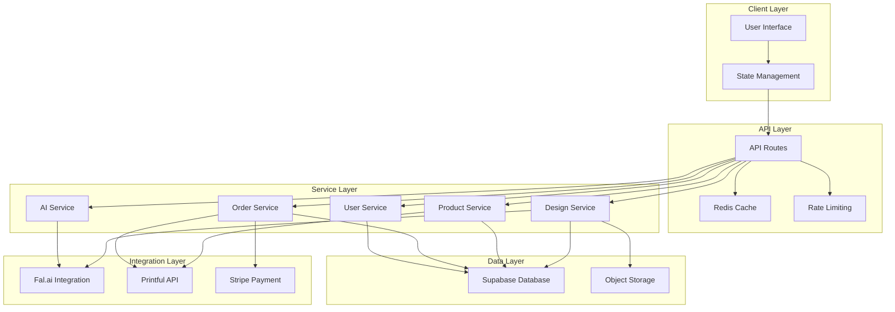
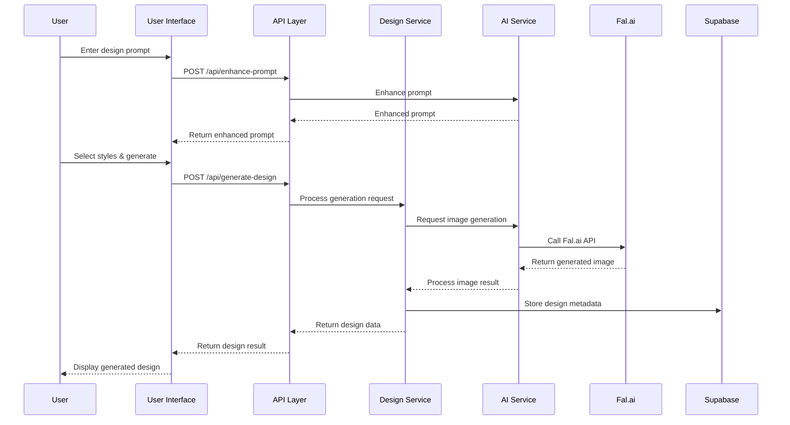
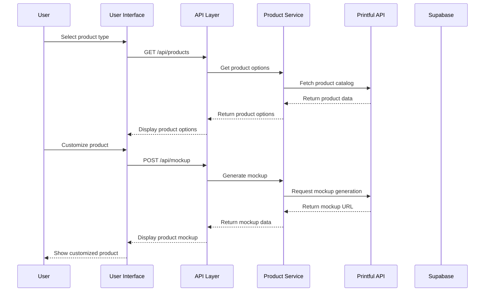
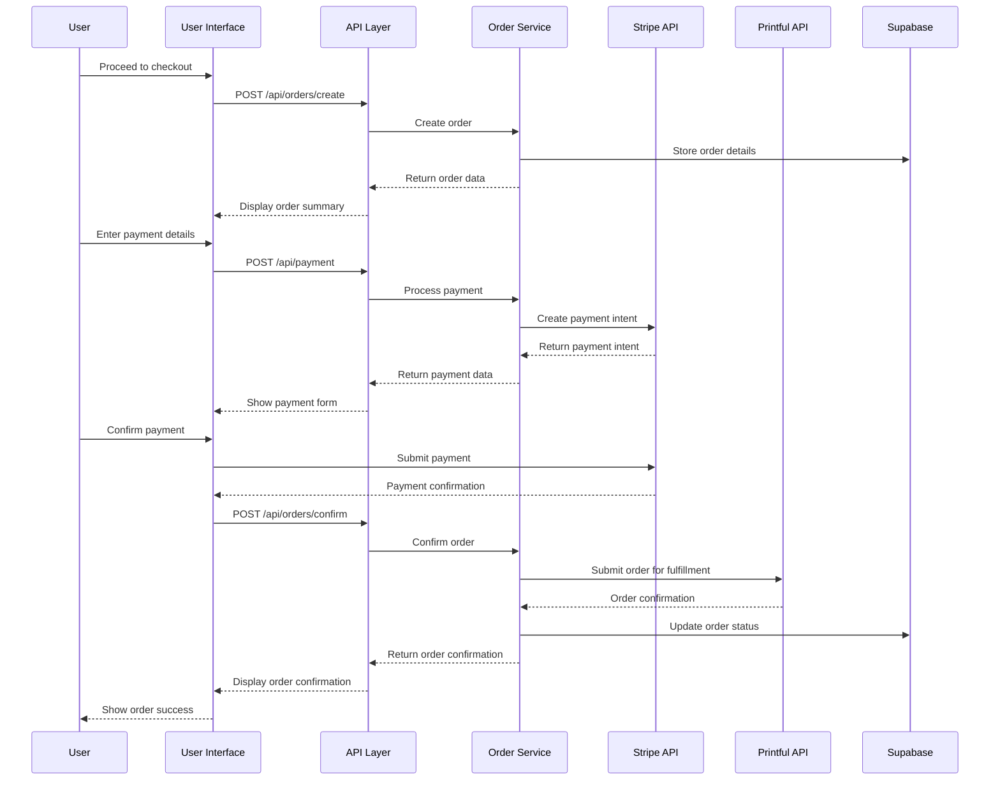

# Cosmic Threads: Technical Architecture

This document outlines the technical architecture for the Cosmic Threads redesign, including system components, data flow, and integration points.

## System Architecture Overview

## Component Details

### Client Layer

#### User Interface
- **Framework**: Next.js 14 with App Router
- **Styling**: Tailwind CSS with custom design system
- **Components**: Shadcn/UI as base with custom retro-futuristic styling
- **Animations**: Framer Motion for fluid transitions and effects

#### State Management
- **Context API**: Design context for creation workflow
- **React Query**: For server state management and caching
- **Zustand**: For global application state

### API Layer

#### API Routes
- **Next.js API Routes**: Serverless functions for backend logic
- **Edge Functions**: For performance-critical operations
- **Middleware**: For authentication, logging, and request processing

#### Caching
- **Redis**: For API response caching and session storage
- **SWR Pattern**: Stale-while-revalidate for optimistic UI updates

#### Rate Limiting
- **Token Bucket Algorithm**: To prevent API abuse
- **IP-based Limiting**: For public endpoints
- **User-based Limiting**: For authenticated endpoints

### Service Layer

#### Design Service
- Manages design creation, storage, and retrieval
- Handles version history and design variants
- Provides design transformation and manipulation

#### AI Service
- Manages prompt enhancement and processing
- Handles image generation requests to Fal.ai
- Provides style transfer and design variation

#### Product Service
- Manages product catalog and variants
- Handles product customization options
- Provides mockup generation for products

#### User Service
- Manages user authentication and profiles
- Handles user preferences and settings
- Provides user design history and favorites

#### Order Service
- Manages order creation and processing
- Handles payment integration with Stripe
- Provides order tracking and fulfillment status

### Integration Layer

#### Fal.ai Integration
- **Flux Model**: For high-quality image generation
- **Batch Processing**: For generating multiple variants
- **Webhook Support**: For asynchronous generation notifications

#### Printful API
- **Product Catalog**: For retrieving available products
- **Mockup Generation**: For visualizing designs on products
- **Order Fulfillment**: For processing and shipping orders

#### Stripe Payment
- **Payment Processing**: For secure checkout
- **Subscription Management**: For premium features
- **Webhook Integration**: For payment event handling

### Data Layer

#### Supabase Database
- **PostgreSQL**: For relational data storage
- **Row-Level Security**: For data access control
- **Real-time Subscriptions**: For live updates

#### Object Storage
- **Supabase Storage**: For design assets and user uploads
- **CDN Integration**: For fast global asset delivery
- **Image Optimization**: For responsive image serving

## Data Flow Diagrams

### Design Generation Flow

### Product Customization Flow

### Checkout Flow

## Performance Optimization Strategy

### Frontend Optimizations
1. **Code Splitting**: Lazy load components and routes
2. **Image Optimization**: Use Next.js Image component with WebP format
3. **CSS Optimization**: Purge unused styles with Tailwind JIT
4. **Bundle Size Reduction**: Tree shaking and dependency optimization
5. **Preloading**: Critical assets and anticipated user paths

### Backend Optimizations
1. **API Caching**: Redis caching for frequently accessed data
2. **Edge Functions**: Deploy performance-critical functions to edge
3. **Database Indexing**: Optimize query performance with proper indexes
4. **Connection Pooling**: Efficient database connection management
5. **Batch Processing**: Group related operations for efficiency

### Network Optimizations
1. **CDN Integration**: Global content delivery for static assets
2. **HTTP/2**: Enable multiplexing for parallel requests
3. **Compression**: Enable Brotli/Gzip compression for responses
4. **Prefetching**: Anticipate user navigation and prefetch resources
5. **Service Worker**: Cache assets and enable offline functionality

## Scalability Considerations

### Horizontal Scaling
- **Stateless API Design**: Enable multiple instances without shared state
- **Load Balancing**: Distribute traffic across multiple instances
- **Database Sharding**: Partition data for improved performance

### Vertical Scaling
- **Resource Optimization**: Efficient use of CPU and memory
- **Database Optimization**: Query optimization and indexing
- **Caching Strategy**: Multi-level caching for hot data

### Microservices Approach
- **Service Isolation**: Independent scaling of high-demand services
- **API Gateway**: Unified entry point for client requests
- **Event-Driven Architecture**: Asynchronous processing for non-critical operations

## Security Measures

### Authentication & Authorization
- **JWT Tokens**: Secure, stateless authentication
- **Role-Based Access Control**: Granular permission management
- **Row-Level Security**: Database-level access control

### Data Protection
- **Encryption at Rest**: Secure storage of sensitive data
- **Encryption in Transit**: HTTPS for all communications
- **Input Validation**: Prevent injection attacks

### API Security
- **Rate Limiting**: Prevent abuse and DoS attacks
- **CORS Policy**: Restrict cross-origin requests
- **Content Security Policy**: Prevent XSS attacks

## Monitoring & Analytics

### Performance Monitoring
- **Core Web Vitals**: Track LCP, FID, and CLS metrics
- **Server Metrics**: CPU, memory, and network utilization
- **API Metrics**: Response times and error rates

### User Analytics
- **Conversion Funnel**: Track user journey and drop-off points
- **Feature Usage**: Monitor which features are most used
- **A/B Testing**: Compare different implementations

### Error Tracking
- **Exception Monitoring**: Capture and alert on errors
- **Log Aggregation**: Centralized logging for troubleshooting
- **User Feedback**: Collect and categorize user-reported issues

This architecture provides a comprehensive foundation for the Cosmic Threads redesign, enabling a scalable, performant, and maintainable application that delivers an exceptional user experience.
