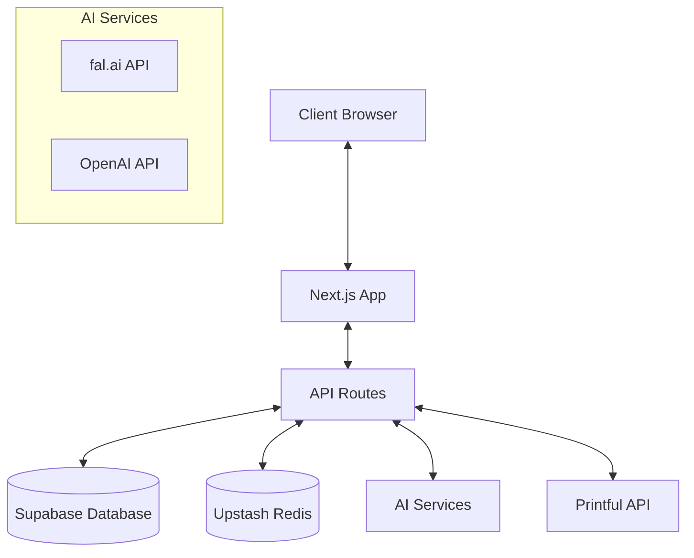
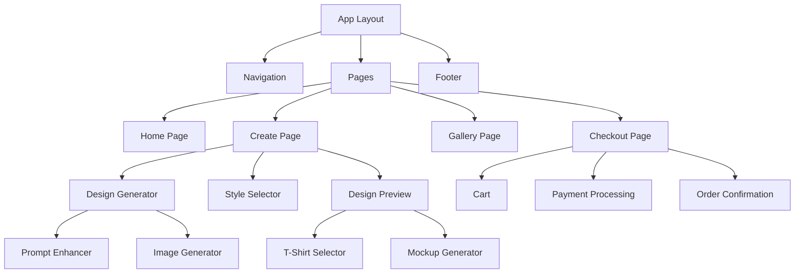

# System Patterns: Cosmic Threads

## System Architecture

Cosmic Threads follows a modern web application architecture built on Next.js with the App Router pattern. The system is structured as follows:

### Key Components

1. **Frontend Layer**
   - Next.js App Router for page routing and server components
   - React components for UI rendering
   - Client-side state management with Context API
   - Tailwind CSS for styling

2. **API Layer**
   - Next.js API routes for backend functionality
   - Authentication middleware for protected routes
   - Rate limiting for public endpoints

3. **Data Layer**
   - Supabase PostgreSQL for persistent storage
   - Upstash Redis for caching and rate limiting
   - Vercel Blob Storage (planned) for file storage

4. **External Services**
   - fal.ai for AI image generation
   - OpenAI for text processing and prompt enhancement
   - Printful for product fulfillment

## Key Technical Decisions

### Next.js App Router
- **Decision**: Use Next.js App Router instead of Pages Router
- **Rationale**: Better performance through server components, simplified data fetching, and improved routing capabilities
- **Impact**: Enables more efficient rendering and better SEO

### Supabase for Database and Auth
- **Decision**: Use Supabase instead of custom auth solution
- **Rationale**: Provides integrated auth, database, and storage with minimal setup
- **Impact**: Faster development cycle and reduced maintenance overhead

### Tailwind CSS with shadcn/ui
- **Decision**: Use Tailwind CSS with shadcn/ui component library
- **Rationale**: Provides consistent styling with minimal CSS, highly customizable components
- **Impact**: Faster UI development and consistent design language

### fal.ai for Image Generation
- **Decision**: Use fal.ai instead of other AI image services
- **Rationale**: Better performance for stylized designs, more control over generation parameters
- **Impact**: Higher quality design outputs with faster generation times

## Design Patterns

### Component Patterns

1. **Composition Pattern**
   - Complex UI components are composed of smaller, reusable components
   - Example: The design studio is composed of prompt input, style selector, and preview components

2. **Container/Presentation Pattern**
   - Separation of data fetching/logic (containers) from rendering (presentation)
   - Example: Design generator handles logic while design preview handles rendering

3. **Higher-Order Components**
   - Components that wrap other components to provide additional functionality
   - Example: Authentication wrapper components for protected routes

### State Management Patterns

1. **Context API with Reducers**
   - Application state is managed through React Context with reducer pattern
   - Provides global state access without prop drilling
   - Example: Cart state is managed through a CartContext

2. **Custom Hooks**
   - Encapsulated reusable logic in custom hooks
   - Example: `useImageGeneration` hook manages the state and logic for generating images

3. **Server State Management**
   - Server-side state is managed through API routes and database
   - Client synchronizes with server state as needed

### API Patterns

1. **RESTful API Design**
   - API routes follow REST principles for resource management
   - Example: `/api/designs` for design-related operations

2. **API Service Layer**
   - Abstraction layer for external API interactions
   - Example: `printful-api.ts` encapsulates all Printful API interactions

3. **Rate Limiting**
   - Protection against abuse through Redis-based rate limiting
   - Applied to public endpoints and AI generation routes

## Component Relationships

### Key Interfaces

1. **User Interface**
   - Components in the `/components` directory
   - UI components from shadcn/ui in `/components/ui`
   - Page components in the `/app` directory

2. **API Interface**
   - API routes in the `/app/api` directory
   - External API clients in the `/lib` directory

3. **Data Interface**
   - Database access through Supabase client
   - Type definitions in `/types` directory

## Error Handling Strategy

1. **Client-Side Error Handling**
   - Try/catch blocks for async operations
   - Error boundaries for component rendering errors
   - Toast notifications for user feedback

2. **Server-Side Error Handling**
   - Structured error responses from API routes
   - Logging for server-side errors
   - Graceful degradation for service failures

3. **AI Generation Fallbacks**
   - Retry mechanisms for failed AI generations
   - Default designs when generation fails
   - Clear user feedback during generation process

## Performance Optimization

1. **Image Optimization**
   - Next.js Image component for optimized image loading
   - Progressive loading for design previews
   - Thumbnail generation for gallery views

2. **Caching Strategy**
   - Redis caching for frequently accessed data
   - Browser caching for static assets
   - Revalidation strategies for dynamic content

3. **Code Splitting**
   - Component-level code splitting
   - Route-based code splitting with Next.js
   - Lazy loading for non-critical components
